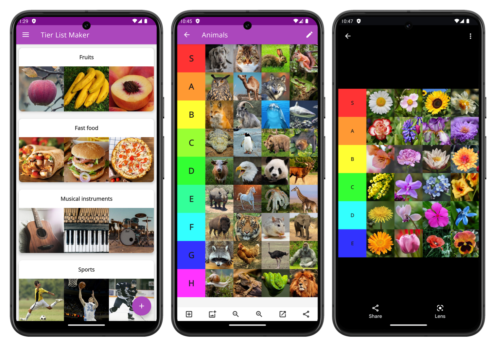

 **Tier List Maker** is an Android application that allows to create, edit and
share [tier lists](https://en.wikipedia.org/wiki/Tier_list).

## Features

- Сreate and edit tier lists
- Upload images from device storage
- Choose between light and dark theme
- Share tier list as image file

## Documentation

| Module | Description |
|---|---|
| [app](docs/app/index.md) | Tier List Maker application module. This is the only Android module in the project. |
| [dokka](docs/app/dokka/index.md) | Kotlin library for custom Dokka plugin. Submodule of the app. |
| [lint](docs/app/lint/index.md) | Kotlin library for custom lint checks. Submodule of the app. |
